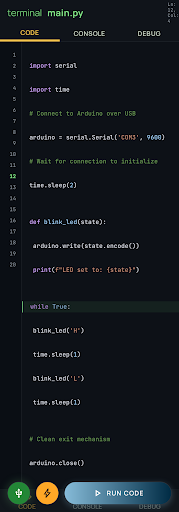
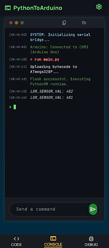
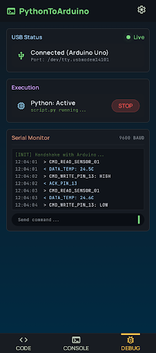
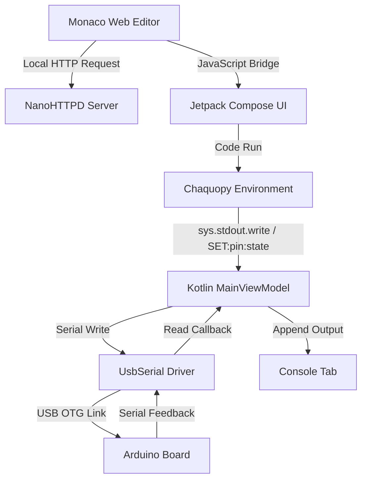

# PythonToArduino 🐍🔌🤖

An advanced Android application that bridges Python execution with Arduino microcontrollers over USB Serial (OTG). Write Python scripts directly on your smartphone, run them in real-time, or compile and flash them onto a connected Arduino board!

---

### [🇮🇹 Leggi la versione in Italiano](#-versione-italiana)

---

## 📸 Screenshots

Here is a preview of the application interface, showcasing its sleek dark theme, modern typography, and robust layout:

| 📝 Code Editor | 💻 Console | ⚙️ Debug & Status |
| :---: | :---: | :---: |
|  |  |  |

---

## 🚀 Key Features

- **Monaco Code Editor**: A desktop-grade code editor experience inside a local WebView. Includes syntax highlighting for Python, line numbers, cursor position indicators, auto-saving, code formatting, and a custom context menu (Copy, Paste, Comment, Select All).
- **Real-Time Python Interpreter**: Powered by **Chaquopy**, allowing you to execute full Python scripts directly on Android without an internet connection.
- **Bi-directional USB Serial**: Stream commands and receive feedback between your Android phone and Arduino at a stabilized 9600 baud rate (using the `felHR85/UsbSerial` library).
- **Real-time Standard Streams Redirect**: Custom Java/Python stream proxies allow the app console to print python `sys.stdout` and `sys.stderr` line-by-line while the script runs, and inject inputs via `sys.stdin`.
- **Compile & Flash Over OTG**: Sends Python code to a local compilation server to compile it into an Arduino hex binary and flashes it directly onto the board over USB OTG.
- **Embedded Web Server**: Integrates a lightweight **NanoHTTPD** web server to run the Monaco Editor offline on localhost, ensuring high performance and zero data latency.
- **Modern Jetpack Compose UI**: Designed using Android's Material 3 guidelines, with a customized futuristic dark mode, custom typography (JetBrains Mono & Manrope), and soft gradients.

---

## 🛠️ Tech Stack & Dependencies

- **Languages**: Kotlin (100% Jetpack Compose UI) and Python (v3.11).
- **Python Integration**: [Chaquopy](https://chaquo.com/chaquopy/) for executing Python scripts on Android.
- **USB Serial Connection**: [UsbSerial](https://github.com/felHR85/UsbSerial) library to control serial devices on Android.
- **Embedded Web Server**: [NanoHTTPD](https://github.com/NanoHttpd/nanohttpd) to serve Monaco Editor assets offline.
- **UI & Layout**: Jetpack Compose, Material 3, and core components for smooth page transitions and responsiveness.

---

## 🏗️ System Architecture



### The Communication Bridge
1. **Interactive Control (Run)**: In this mode, the Python script executes on the phone. Standard print commands like `turn(13, ON)` are intercepted by `my_script.py`, translated to `SET:13:1\n` commands, and routed via `SerialManager` to the Arduino.
2. **Firmware Compilation (Compile & Flash)**: The app sends your Python code to a backend compilation server (defined in `build.py`). The server compiles it to an Arduino HEX file, returns the binary, and the app's flashing loader pushes the code to the microcontroller.

---

## 📝 Code Examples

### 1. Python Code (Running inside the App)
```python
# script1.py - Blink LED on Pin 13
import time

print("Starting Blink Cycle...")
while is_running():
    turn(13, ON)
    print("LED is ON")
    delay(1000) # 1 second delay
    
    turn(13, OFF)
    print("LED is OFF")
    delay(1000)
```

### 2. Matching Arduino Sketch (To upload to your Board)
Load this sketch onto your Arduino to interpret the serial commands sent by the Python script:

```cpp
#define SERIAL_BAUD 9600

void setup() {
  Serial.begin(SERIAL_BAUD);
  // Optional: Send initial confirmation to Android console
  Serial.println("Arduino ready for Python commands!");
}

void loop() {
  if (Serial.available() > 0) {
    String command = Serial.readStringUntil('\n');
    command.trim();

    // Parse commands in the format "SET:pin:value"
    if (command.startsWith("SET:")) {
      int firstColon = command.indexOf(':');
      int secondColon = command.indexOf(':', firstColon + 1);

      if (firstColon != -1 && secondColon != -1) {
        String pinStr = command.substring(firstColon + 1, secondColon);
        String valStr = command.substring(secondColon + 1);

        int pin = pinStr.toInt();
        int val = valStr.toInt();

        pinMode(pin, OUTPUT);
        digitalWrite(pin, val);

        // Send feedback back to Android Console
        Serial.print("SUCCESS: Pin ");
        Serial.print(pin);
        Serial.println(val == 1 ? " set to HIGH" : " set to LOW");
      }
    }
  }
}
```

---

## ⚡ Setup & Installation

### Prerequisites
- An Android device running **Android 7.0 (Nougat, API 24)** or higher.
- A USB OTG cable / adapter to connect your Android device to the Arduino.
- **Android Studio Jellyfish / Koala** or newer.

### Build Android App
1. Clone the repository:
   ```bash
   git clone https://github.com/andrewgall25/PythonToArduino.git
   ```
2. Open the project in **Android Studio**.
3. Let Gradle sync and download dependencies.
4. Build the application and run it on your physical Android device.
5. Grant USB permission when connecting the Arduino to the phone.

### Compilation Server Setup (Optional)
The compile & flash feature relies on an external server defined in `build.py`:
- By default, it expects a Flask server at `http://192.168.1.103:5000/build`.
- You can configure this IP to match your local computer's address running the compilation service.

---

## 🇮🇹 Versione Italiana

### Panoramica del Progetto
**PythonToArduino** è un'applicazione Android avanzata progettata per far comunicare script Python eseguiti sul telefono con schede Arduino collegate tramite USB OTG. Puoi scrivere codice Python, eseguirlo in tempo reale o inviarlo a un server locale per compilarlo ed effettuarne il flashing direttamente sul microcontrollore.

### Funzionalità Principali
- **Editor Monaco Integrato**: Un editor professionale ospitato localmente tramite un server web **NanoHTTPD** in WebView. Supporta l'autocompletamento, l'evidenziazione della sintassi, il salvataggio automatico dei file `.py` e un menu contestuale completo.
- **Interprete Python (Chaquopy)**: Esecuzione in tempo reale del codice sul dispositivo mobile senza dipendere da connessioni internet.
- **Flusso Seriale Bidirezionale**: Monitoraggio continuo dello stato di connessione USB e scambio dati tramite la libreria `UsbSerial`. I comandi generati (come `SET:pin:stato`) vengono inviati all'Arduino, che a sua volta può inviare stringhe visualizzate istantaneamente nella console dell'app.
- **Compilazione & Flash**: Un pratico pulsante permette di inviare lo script a un server Flask per generare il file HEX compilato e caricarlo sulla scheda Arduino.

### Sketch Arduino Consigliato
Per far funzionare l'applicazione con Arduino, assicurati di caricare sulla scheda il codice fornito nella sezione **[Arduino Sketch Example](#2-matching-arduino-sketch-to-upload-to-your-board)**. Questo codice si occuperà di decodificare il comando `SET:<pin>:<val>` e impostare lo stato del pin fisico di conseguenza.

---

## 📄 License
This project is licensed under the MIT License - see the [LICENSE](LICENSE) file for details.
